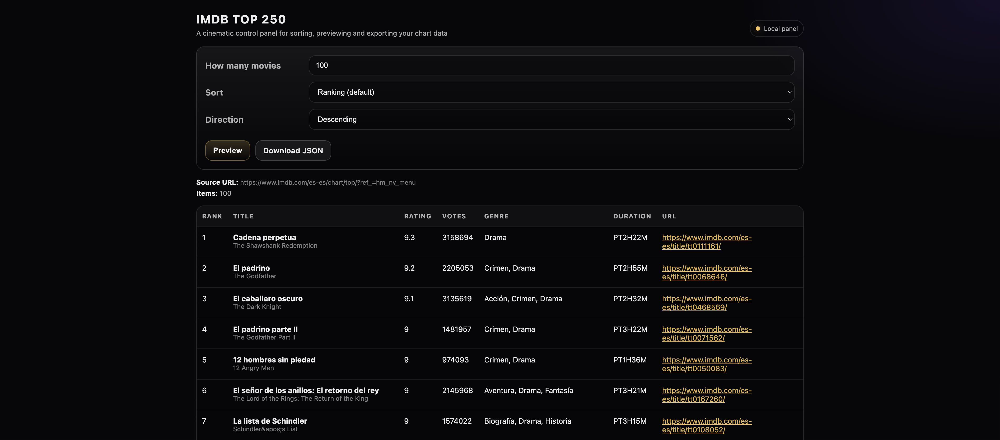

# IMDBspider



A web scraping project that extracts data from IMDb's Top 250 movies chart using Scrapy and provides a web control panel for data exploration.

## 🎯 Project Overview

This project consists of two main components:

1. **Scrapy Spider** (`imdb.py`) - A robust web scraper that extracts movie data from IMDb's Top 250 chart
2. **Web Control Panel** (`control_panel.py`) - A Flask-based web interface for browsing and downloading the scraped data

The scraper uses intelligent parsing techniques to extract data from IMDb's JSON-LD structured data, making it more resilient to website changes compared to traditional CSS-based scraping.

## 📋 Features

- Extracts comprehensive movie data including title, rating, vote count, genre, duration, and more
- Web interface for filtering and sorting results
- JSON export functionality
- RESTful API endpoint
- Robust error handling and diagnostics
- Modern browser-like HTTP requests to avoid blocking

## 🚀 Quick Start

### Prerequisites

- Python 3.8 or higher
- pip package manager

### Installation

From the repository root:

```bash
# Create and activate virtual environment
python3 -m venv .venv
source .venv/bin/activate

# Install dependencies
python -m pip install -U pip
python -m pip install -r IMDBapp/requirements.txt
```

### Running the Spider

```bash
cd IMDBapp

# List available spiders
scrapy list

# Run the IMDb spider
scrapy crawl imdb

# Save output to JSON file
scrapy crawl imdb -O output.json
```

### Web Control Panel

From the repository root:

```bash
# Activate virtual environment (if not already active)
source .venv/bin/activate

# Start the web interface
python IMDBapp/control_panel.py
```

Then open your browser and navigate to:
```
http://127.0.0.1:5000
```

## 🛠️ Usage

### Web Interface Features

- **Filtering**: Limit the number of results (1-250 movies)
- **Sorting**: Sort by ranking, IMDb rating, release date, rating count, title, popularity, or runtime
- **Direction**: Sort in ascending or descending order
- **Export**: Download results as JSON file
- **API Access**: Use `/api/movies` endpoint for programmatic access

### API Endpoints

- `GET /` - Main web interface
- `POST /preview` - Apply filters and preview results
- `GET /download.json` - Download filtered results as JSON
- `GET /api/movies` - RESTful API endpoint with query parameters

### API Parameters

- `limit` - Number of movies to return (1-250, default: 50)
- `sort` - Sort field (RANKING, USER_RATING, RELEASE_DATE, etc.)
- `direction` - Sort direction (asc/desc)

Example API call:
```bash
curl "http://127.0.0.1:5000/api/movies?limit=10&sort=USER_RATING&direction=desc"
```

## 📊 Data Structure

Each movie entry contains:

```json
{
  "rank": 1,
  "url": "https://www.imdb.com/title/tt0111161/",
  "name": "The Shawshank Redemption",
  "alternateName": "Cadena perpetua",
  "description": "Two imprisoned men bond over a number of years...",
  "image": "https://m.media-amazon.com/images/...",
  "ratingValue": 9.3,
  "ratingCount": 2800000,
  "contentRating": "R",
  "genre": ["Drama"],
  "duration": "PT142M"
}
```

## 🔧 Technical Details

### Scraping Strategy

The scraper uses a hybrid approach:

1. **HTML Parsing**: Extracts IMDb's canonical chart rank from anchor URLs
2. **JSON-LD Extraction**: Parses structured data embedded in the page for stable movie information

This approach is more resilient to website changes since JSON-LD is designed for machines and tends to be more stable than visual HTML structure.

### Dependencies

Key libraries include:
- **Scrapy** - Web scraping framework
- **Flask** - Web framework for control panel
- **Requests** - HTTP client library
- **lxml** - XML/HTML parser
- **BeautifulSoup** (via parsel) - HTML parsing

## ⚠️ Disclaimer

**This project was originally created in 2023 and has been updated in 2026 to work with the current IMDb website structure.**

**Important Notice**: If this scraper stops working, it is likely because IMDb has changed their website structure, HTML layout, or API endpoints. Web scraping projects require ongoing maintenance as target websites evolve. The author (me) makes no guarantees about continued functionality and is not responsible for any issues that arise from website changes.

### Legal and Ethical Considerations

- This tool is for educational and personal use only
- Respect IMDb's Terms of Service
- Use reasonable request rates to avoid overwhelming the server
- Do not use the scraped data for commercial purposes without proper attribution
- Consider using IMDb's official API for production use cases

## 🐛 Troubleshooting

### Common Issues

1. **HTTP 403/429 Errors**: IMDb may be rate-limiting requests
   - Solution: Wait longer between requests or use different user agents

2. **Empty Results**: Website structure may have changed
   - Solution: Check if JSON-LD data is still present in the page source

3. **Import Errors**: Missing dependencies
   - Solution: Ensure all requirements are installed in the virtual environment

### Debug Mode

Enable debug output by setting environment variables:
```bash
export SCRAPY_LOG_LEVEL=DEBUG
python IMDBapp/control_panel.py
```

## 📝 License

This project is provided for educational purposes. Please respect IMDb's terms of service and use responsibly.

## 🤝 Contributing

Feel free to submit issues or pull requests to improve the project. When contributing, please ensure that:

- Code follows Python best practices
- Changes maintain compatibility with IMDb's terms
- Documentation is updated accordingly

---

**Last Updated**: February 2026  
**Original Creation**: 2023